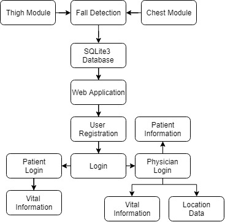

# IoT-Based-Fall-Detection-System

In general, most of the people want to have an independent life and live on themselves, especially patients and elderly people. It is essential to monitor their vital signs, health and safety. Internet of Things (IoT) has provides better access to monitor the data remotely. If the person has had a fall at a remote location, it’s a tedious task to find the patient. So, the location of a fall of a patient is also important along with the detection of a fall. Incorporating body sensors that are connected to the internet and the data from these sensors along with the location is saved on the database.			          It is then analyzed and interpreted through a website. In this project we monitor the vital data of a person through a website created and provides a remote system for alerting and detecting dangerous falls of the patient to the physician. With the help of data analysis, we analyze the vital information of the patient along with the location of the patient and trigger an email to the physician so that proper actions can be taken at the right time.  
Keywords: IoT, Web Application, fall detection, Health Monitoring

